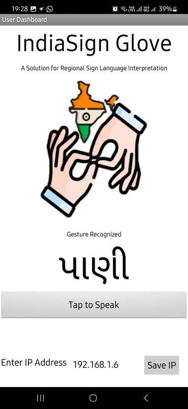

# IndiaSignGlove

IndiaSignGlove is a smart wearable glove project designed to recognize Indian sign language gestures and translate them into Gujarati words. It uses flex sensors and touch sensors to detect hand gestures, sends recognized words to a webserver, and can send emergency SMS alerts via Twilio.


## Features

- Detects hand gestures using flex and touch sensors.
- Recognizes Indian sign language gestures and converts them to Gujarati words.
- Hosts an HTTP webserver to serve recognized gestures in real-time.
- Sends emergency SMS alerts via Twilio when the emergency button is pressed.
- Calibrates flex sensors for accurate gesture detection.


## Hardware Setup

- ESP32 microcontroller
- 5 Flex Sensors connected to analog pins: 36, 34, 35, 32, 33
- 4 Touch sensors connected to digital pins: 26, 27, 14, 12
- Emergency button connected to digital pin 23


## Software Overview

### Files

- `main.ino`  
  Main Arduino sketch that connects to WiFi, calibrates sensors, reads sensor data, recognizes gestures, runs the webserver, and sends SMS.

- `gestures.h`  
  Defines known gesture patterns and provides the function to recognize gestures.

- `gesture_webserver.h`  
  Implements a simple HTTP server that serves the last recognized Gujarati word.

- `twilio_sms.h`  
  Sends SMS messages using Twilio API over HTTPS.


### Gesture Recognition

Gestures are recognized based on the bend (B = Bent, S = Straight) states of fingers and touch sensor inputs. Each gesture has a unique pattern mapped to a Gujarati word.

Example pattern:  
```
S B S S S | 0 0 0 0  -> "છે"
```


### Webserver

- Runs on port 80.
- Serves the last recognized Gujarati word as plain text on the root path `/`.


### Emergency SMS

- When the emergency button is pressed, an SMS alert is sent to the configured phone number via Twilio.


## How to Use

1. Set your WiFi credentials in `main.ino`:
   ```cpp
   const char* ssid = "YOUR_SSID";
   const char* password = "YOUR_PASSWORD";
   ```

2. Set your Twilio credentials and phone numbers in `main.ino`:
   ```cpp
   const char* account_sid = "YOUR_ACCOUNT_SID";
   const char* auth_token = "YOUR_AUTH_TOKEN";
   const char* from_number = "YOUR_TWILIO_NUMBER";
   const char* to_number = "RECIPIENT_NUMBER";
   ```

3. Upload the code to the ESP32.

4. Open Serial Monitor at 115200 baud to view calibration prompts and recognized gestures.

5. Visit the ESP32 IP address (shown in Serial Monitor) in a browser to see the last recognized Gujarati word.

6. Press the emergency button to send an emergency SMS.


## Calibration

During startup, the device will prompt you to:

- Hold fingers straight and press any key in Serial Monitor.
- Then hold fingers bent fully and press any key.

This calibrates the min and max resistance values for the flex sensors.


## Code Snippets

### Recognizing Gestures

```cpp
String recognizeGesture(String currentGesture) {
  for (int i = 0; i < NUM_GESTURES; i++) {
    if (gestures[i].pattern == currentGesture) {
      return gestures[i].meaning;
    }
  }
  return "UNKNOWN";
}
```

### Webserver Setup

```cpp
void startGestureWebServer() {
  server.on("/", handleRoot);
  server.begin();
  Serial.println("🌐 HTTP server started");
}
```

### Sending SMS via Twilio

```cpp
bool sendSMS(String message) {
  // Uses WiFiClientSecure to POST message to Twilio API
}
```


## Mobile App (MIT App Inventor)

To provide a seamless user experience, IndiaSignGlove is paired with an intuitive Android mobile application built using MIT App Inventor. This app serves as the visual and auditory interface between the glove and the user, enabling real-time gesture recognition feedback and emergency alerts.


### Features 

- IP Address Configuration
  Allows users to input and save the ESP32's IP address to retrieve gesture data.
- Real-Time Gesture Display 
  Continuously fetches recognized gestures from the ESP32 and displays them in Gujarati.
- Text-to-Speech
  Users can tap a button to hear the recognized word spoken aloud using Gujarati language TTS.
- Emergency Detection
  Displays a red alert when an "Emergency" keyword is detected, accompanied by a warning sound and temporary visual alert.
- Error Handling
  Built-in blocks to handle connectivity issues gracefully.


### IndiaSign Glove App UI

#### IndiaSign Glove App - Dashboard 


#### IndiaSign Glove App - Displaying Recognized Gesture 



 

### Communication

- ESP32 must run a webserver serving gesture data.
- The app sends requests to `http://<ESP_IP>/` every second to read the recognized word.


### App Deployment 

- Export `.apk` from MIT App Inventor for direct installation.


## License

This project is licensed under the MIT License. See the [LICENSE](LICENSE) file for details.


## Contributors

- Rachit Sharma  
- Labdhi Shah
- Pratha Patel


## Contact

For questions or suggestions, contact Rachit Sharma.

